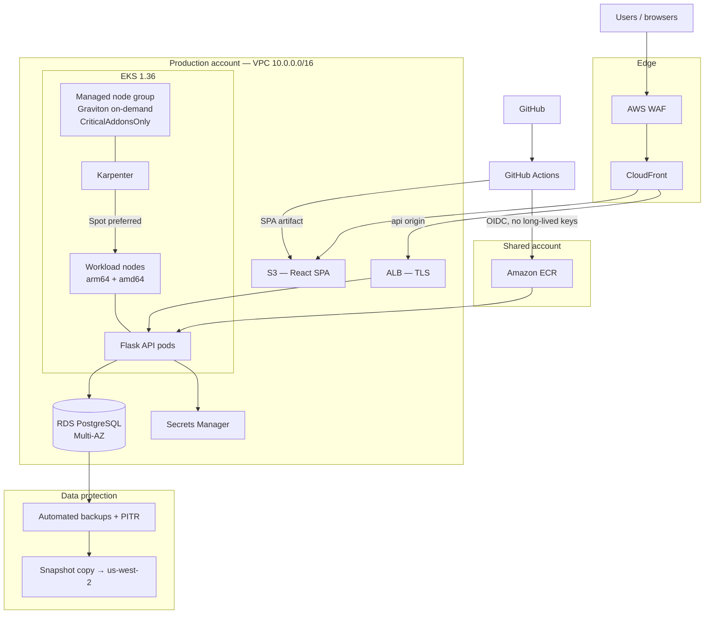
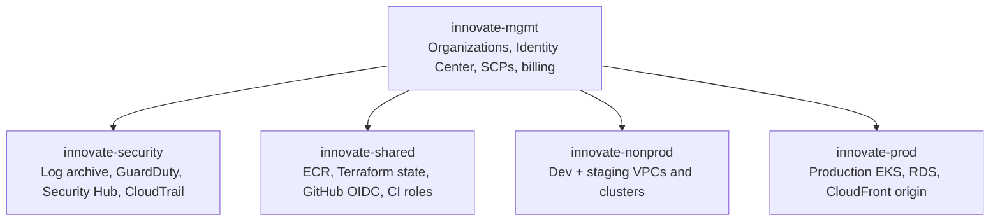
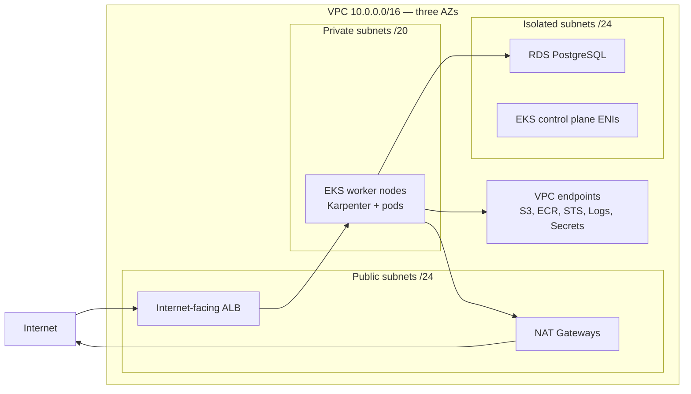
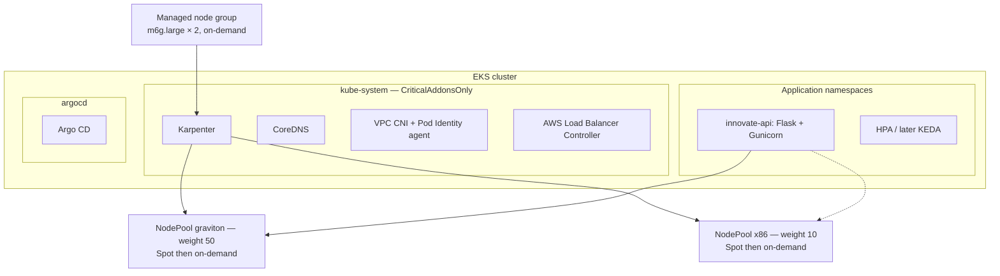
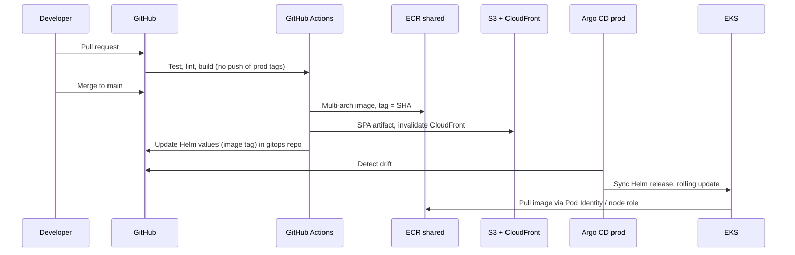

# Innovate Inc. Cloud Architecture

Architecture design for Innovate Inc.'s web application: a React SPA, a Python/Flask REST API, and PostgreSQL. The platform must be secure enough for sensitive user data, cheap enough for a few hundred users per day, and able to grow toward millions without a rewrite.

**Cloud choice: Amazon Web Services.** GCP (GKE Autopilot + Cloud SQL) would also work. AWS is the recommendation because Karpenter, Graviton, and RDS PostgreSQL give a clear cost path from a small cluster to large scale, and this repository already has a working EKS + Karpenter foundation in [`terraform/`](../terraform/README.md). A GCP mapping is in [Appendix A](#appendix-a-gcp-equivalent).

| Concern    | Decision                                     |
| ---------- | -------------------------------------------- |
| Org layout | 5 AWS accounts under Organizations           |
| Region     | `us-east-1` primary, `us-west-2` for backups |
| Frontend   | S3 + CloudFront + WAF (not in the cluster)   |
| API        | Amazon EKS, Karpenter, Graviton + Spot       |
| Database   | Amazon RDS for PostgreSQL, Multi-AZ          |
| Delivery   | GitHub Actions (CI) + Argo CD (CD)           |

---

## High-level design

Users hit CloudFront. Static React assets come from S3. API traffic is forwarded to an internal EKS cluster sitting on private subnets. The API talks to RDS over the VPC; it never reaches the internet except through NAT or VPC endpoints for AWS APIs.

Request path:

1. Browser loads the SPA from CloudFront (cached, TLS, WAF) at `app.innovate.example`.
2. The SPA calls `https://api.innovate.example`. That hostname is a second CloudFront distribution (or behavior) whose origin is the ALB.
3. The ALB terminates TLS (ACM) and sends HTTP to Flask pods on private nodes.
4. Flask reads and writes RDS. Credentials come from Secrets Manager via EKS Pod Identity. The database has no public endpoint.

---

## 1. Cloud environment structure

A single AWS account is the wrong default. Blast radius, billing, and IAM all get worse as soon as a second engineer or a production incident appears. A full Control Tower landing zone (ten or more accounts) is also the wrong default for a startup that has never run cloud infrastructure.

**Five accounts** under AWS Organizations is the smallest layout that still matches AWS isolation, billing, and security practice.

| Account               | Purpose                                                                                                            | Why it exists                                                                                                                                                                |
| --------------------- | ------------------------------------------------------------------------------------------------------------------ | ---------------------------------------------------------------------------------------------------------------------------------------------------------------------------- |
| **innovate-mgmt**     | Payer. AWS Organizations, IAM Identity Center (SSO), Service Control Policies, consolidated billing. No workloads. | Billing and identity belong above every environment. SSO in the management account is the AWS-supported pattern.                                                             |
| **innovate-security** | Organization CloudTrail, GuardDuty delegated admin, Security Hub, a locked S3 log archive, AWS Config aggregator.  | Sensitive user data requires a place where logs cannot be deleted by the people who operate prod. This is the cheapest compliance boundary that still works.                 |
| **innovate-shared**   | Amazon ECR, S3 + DynamoDB for Terraform remote state, IAM roles that GitHub Actions assumes via OIDC.              | Images and pipelines are shared; they should not live in prod (where a pipeline role is over-privileged) or in nonprod (where a leak does not belong in production deploys). |
| **innovate-nonprod**  | Dev and staging VPCs, a smaller EKS cluster, a single-AZ RDS instance.                                             | One account is enough until staging needs prod-like isolation. Two VPCs inside it keep CIDRs and blast radius separate without doubling account overhead.                    |
| **innovate-prod**     | Production VPC, EKS, RDS Multi-AZ, ALB, CloudFront origin, KMS keys for app data.                                  | Production IAM, data, and spend stay out of everyone else's account.                                                                                                         |

Identity Center lives in mgmt. Humans never use long-lived access keys. Permission sets map to jobs (PlatformAdmin, Developer, ReadOnly) and are granted per account. Developers get admin in nonprod and read-only plus `eks:Access` scoped roles in prod.

Service Control Policies applied from mgmt, before IAM:

- Deny leaving the organization and deny disabling CloudTrail, GuardDuty, or Config.
- Restrict regions to `us-east-1` and `us-west-2`.
- Deny creating IAM users (Identity Center only).
- Deny public S3 ACLs and deny disabling default EBS / RDS encryption.

Consolidated billing lands in mgmt. Cost allocation tags (`Environment`, `Application`, `Owner`) are required by SCP so nonprod experiments are visible without mixing into the production bill.

**What was rejected**

| Option                         | Why not                                                                                                                   |
| ------------------------------ | ------------------------------------------------------------------------------------------------------------------------- |
| One account, several VPCs      | A leaked CI role or a bad IAM policy can destroy production data. Billing cannot separate research spend from production. |
| Account per engineer           | Operational noise. Identity Center + permission sets already isolate people.                                              |
| Control Tower + AFT on day one | Weeks of setup for a team that has not yet shipped. Organizations + Terraform is enough; AFT can come later.              |
| Separate staging account now   | Right when a second product, PCI scope, or a dedicated SRE team appears — not at a few hundred users.                     |

---

## 2. Network design

Each workload account gets its own VPC. CIDRs do not overlap, so peering or a future shared-services transit gateway does not require renumbering.

| Environment | VPC CIDR      | NAT                    | EKS                 | RDS       |
| ----------- | ------------- | ---------------------- | ------------------- | --------- |
| Prod        | `10.0.0.0/16` | One NAT Gateway per AZ | Multi-AZ            | Multi-AZ  |
| Staging     | `10.1.0.0/16` | Single NAT             | Multi-AZ            | Single-AZ |
| Dev         | `10.2.0.0/16` | Single NAT             | 2 AZs is acceptable | Single-AZ |

The production VPC uses three Availability Zones and three subnet tiers. That matches the layout already implemented in [`terraform/vpc.tf`](../terraform/vpc.tf).

CIDR plan for prod (`10.0.0.0/16`):

| Tier     | Blocks                                         | Size                     | What lives here                                                                              |
| -------- | ---------------------------------------------- | ------------------------ | -------------------------------------------------------------------------------------------- |
| Private  | `10.0.0.0/20`, `10.0.16.0/20`, `10.0.32.0/20`  | ~4,090 usable IPs per AZ | Nodes and pods (VPC CNI assigns pod IPs from the subnet). Sized for growth, not for day one. |
| Public   | `10.0.48.0/24`, `10.0.49.0/24`, `10.0.50.0/24` | /24 per AZ               | ALB, NAT Gateways. Kubernetes tag `kubernetes.io/role/elb=1`.                                |
| Isolated | `10.0.52.0/24`, `10.0.53.0/24`, `10.0.54.0/24` | /24 per AZ               | RDS and EKS control-plane ENIs. No 0.0.0.0/0 route.                                          |

Private subnets carry `kubernetes.io/role/internal-elb=1` and `karpenter.sh/discovery=<cluster>`. Isolated subnets have no NAT and no Internet Gateway route, so a mis-attached security group still cannot put RDS on the internet.

### How the network is secured

**Perimeter**

- CloudFront + AWS WAF in front of the SPA and, optionally, the API hostname. Managed rule groups: Amazon IP reputation, known bad inputs, Linux/PHP, rate-limit on `/api/login` and password-reset paths. Shield Standard is included; Shield Advanced is deferred until a real DDoS budget exists.
- ALB listeners are HTTPS only (TLS 1.2+, ACM certificates). HTTP on 80 redirects to 443.
- S3 bucket for the SPA is private. CloudFront accesses it through Origin Access Control. Block Public Access stays on.

**In the VPC**

- Security groups are the primary control. NACLs stay as the VPC default (allow all); they are a blunt instrument and are not used for app policy.
- ALB SG: ingress 443 from CloudFront prefix lists (or `0.0.0.0/0` if the ALB is the public API hostname), egress to node SG on the app port.
- Node SG: ingress from ALB SG and from itself (pod-to-pod); egress to RDS SG on 5432, to VPC endpoints, and to NAT for the few pulls that still need the internet.
- RDS SG: ingress 5432 **only** from the node SG (and from RDS Proxy, if introduced). No public accessibility flag. No `0.0.0.0/0`.
- EKS API: private endpoint on; public endpoint restricted to GitHub Actions egress IPs plus the office/VPN CIDR. Day-to-day `kubectl` uses SSM port-forwarding or a small VPN, not a world-open API.

**Private AWS APIs**

Interface and gateway endpoints for S3, ECR (api + dkr), STS, CloudWatch Logs, ECR Public, and Secrets Manager. Image pulls and secret reads never traverse NAT. That is both a security control and the main NAT cost lever once traffic grows.

**Detection**

- VPC Flow Logs → the security account log archive.
- GuardDuty including EKS audit and runtime protections, delegated to `innovate-security`.
- CloudTrail organization trail, immutable in the security account.

**What is not in the design**

A always-on bastion host. Break-glass access is SSM Session Manager onto a node, or a short-lived VPN. SSH keys on instances are disabled.

---

## 3. Compute platform

The API runs on **Amazon EKS**. The React SPA does **not**. Serving a static bundle from the cluster would waste node capacity, complicate TLS and caching, and cost more than S3 + CloudFront.

The cluster layout is the same pattern already running in this repo: a tiny on-demand Graviton managed node group for Karpenter and add-ons, and Karpenter NodePools for everything that serves traffic.

### Node groups, scaling, and resource allocation

**System nodes (EKS managed node group)**

- Instance: `m6g.large` (arm64), on-demand, min 2 / max 3.
- Taint: `CriticalAddonsOnly=true:NoSchedule`.
- Label: `karpenter.sh/controller=true`.
- Purpose: Karpenter, CoreDNS, VPC CNI, kube-proxy, Load Balancer Controller. Workload pods cannot schedule here.

Two nodes exist so a single AZ or instance failure does not take down the provisioner.

**Workload nodes (Karpenter)**

Two NodePools, both preferring Spot and falling back to on-demand, with disruption budgets so consolidation does not drain everything at once:

| Pool       | Arch  | Weight | Typical types   | Role                                                   |
| ---------- | ----- | ------ | --------------- | ------------------------------------------------------ |
| `graviton` | arm64 | 50     | m7g / m6g / c7g | Default for Flask. Lower price per vCPU.               |
| `x86`      | amd64 | 10     | m7a / m6a / m6i | Escape hatch for any image that is not multi-arch yet. |

Karpenter provisions a node only when a pod is unschedulable, and deletes it when the pod goes away. That is how the cluster stays near zero extra capacity at a few hundred users per day, and how it absorbs a traffic spike without a human changing ASG sizes.

**Pod scaling**

- Horizontal Pod Autoscaler on CPU (target ~70%) from day one. Minimum 2 replicas in prod (PodDisruptionBudget `minAvailable: 1`).
- Resource requests and limits on every container. A LimitRange in `innovate-api` rejects pods that omit them. A ResourceQuota caps the namespace so a runaway deploy cannot starve CoreDNS.
- When request rate, not CPU, becomes the signal — typically well before “millions of users” — add KEDA with ALB request-count or CloudWatch metrics.
- Topology spread (`maxSkew: 1` across zones) so two replicas are not packed onto one AZ.

**Add-ons**

AWS Load Balancer Controller (Ingress → ALB), ExternalDNS if Route 53 is used, metrics-server, EKS Pod Identity agent, and optionally AWS Distro for OpenTelemetry later. Cluster Autoscaler is not installed; Karpenter replaces it.

### Containerization, registry, and deploy

**Build**

- Multi-stage Dockerfile: build with the official Python image, run on a slim or distroless runtime, non-root user, no shell in the final image if practical.
- `docker buildx` produces `linux/arm64` and `linux/amd64` and pushes a single OCI index to ECR. Flask then lands on Graviton without an x86 tax.
- Image tag is the git SHA. `latest` is not used for deploys.

**Registry**

- Amazon ECR in `innovate-shared`. Prod and nonprod pull across accounts via resource policy.
- Scan on push (Amazon Inspector). Critical OS CVEs fail the GitHub Actions gate.
- Lifecycle policy: keep the last 30 prod tags, expire untagged and PR images after 14 days.

**Deploy**

CI is GitHub Actions with **OIDC federation** into `innovate-shared` (and a deploy role in each workload account). No access keys in GitHub secrets.

CD is Argo CD in each cluster, syncing a dedicated gitops repo. Production sync is automated for image-tag bumps on `main` after staging has run its smoke tests; a manual approval GitHub Environment sits in front of the first several production weeks, then can be removed once the pipeline is trusted.

Helm charts own replicas, PDB, HPA, probes, Pod Identity associations, and Ingress. Kubernetes Secrets are not committed; External Secrets Operator (or the Secrets Store CSI driver) materializes RDS credentials from Secrets Manager.

**Runtime hardening**

- Pod Security Admission `restricted` on `innovate-api`.
- NetworkPolicy: ingress only from the ALB controller / node SG path; egress only to RDS, DNS, and AWS endpoints.
- Read-only root filesystem, drop all capabilities, no privilege escalation.
- IRSA / Pod Identity for AWS APIs. The node role cannot read Secrets Manager or the database password.

---

## 4. Database

**Amazon RDS for PostgreSQL** (managed, not a Postgres operator on EKS).

Self-hosting Postgres on Kubernetes would make the team that “has limited experience with cloud infrastructure” responsible for failover, backups, storage, and major-version upgrades. RDS already does that work, encrypts at rest, and integrates with IAM, KMS, and Secrets Manager.

Aurora PostgreSQL is the scale-up path, not the starting point. At a few hundred users per day, RDS Multi-AZ is simpler and cheaper. Aurora Serverless v2 and reader instances become the right move when connections, IOPS, or failover time actually hurt.

|         | Day one (prod)                                       | When traffic demands it                                                                                                           |
| ------- | ---------------------------------------------------- | --------------------------------------------------------------------------------------------------------------------------------- |
| Engine  | RDS PostgreSQL 16, `db.t4g.medium` or `db.r6g.large` | Aurora PostgreSQL Serverless v2, min 0.5 ACU in non-peak if cost requires it                                                      |
| HA      | Multi-AZ standby, same region                        | Aurora writers + readers in 3 AZs                                                                                                 |
| Pooling | RDS Proxy in front of RDS once replica count grows   | RDS Proxy or PgBouncer; required before “millions of users” because Postgres connections do not scale linearly with Flask workers |
| Reads   | Primary only                                         | Aurora readers or RDS read replica; API uses a read/write split                                                                   |

The instance lives on isolated subnets, encryption at rest with a prod customer-managed KMS key, encryption in transit (`rds.force_ssl=1`), and credentials rotated in Secrets Manager. The Flask app never sees a hardcoded password.

Nonprod uses a single-AZ `db.t4g.small` and a shorter backup window. Production-sized clones can be restored from anonymized snapshots when a realistic dataset is needed.

### Backups, high availability, and disaster recovery

| Control             | Setting                                            | What it buys                                                                                                           |
| ------------------- | -------------------------------------------------- | ---------------------------------------------------------------------------------------------------------------------- |
| Automated backups   | 7 days nonprod, 35 days prod                       | Point-in-time recovery (PITR) to any second in the window                                                              |
| PITR                | Enabled (default with automated backups)           | Accidental `DROP` or bad migration: restore to a new instance, cut the app over                                        |
| Multi-AZ            | Prod only                                          | Synchronous standby; automatic failover on instance or AZ failure (typically 60–120 seconds)                           |
| Storage             | gp3, encryption on                                 | IOPS can be raised without a resize; snapshots are encrypted                                                           |
| Snapshot copy       | Daily copy of the prod snapshot to `us-west-2`     | Region-level disaster: restore RDS in the DR region, point DNS at a newly created ALB/EKS or a documented cold standby |
| Deletion protection | On in prod                                         | Guards against `terraform destroy` and console mistakes                                                                |
| Schema migrations   | Expand/contract via CI, never hand-applied in prod | Rollback is a forward migration, not a restored backup, for routine releases                                           |

**Recovery targets (prod)**

| Event                                         | RPO                                                                     | RTO                                              | Mechanism                                                                             |
| --------------------------------------------- | ----------------------------------------------------------------------- | ------------------------------------------------ | ------------------------------------------------------------------------------------- |
| Instance or AZ failure                        | ~0 (sync standby)                                                       | 1–3 minutes                                      | RDS Multi-AZ failover                                                                 |
| Logical data loss (bad deploy, dropped table) | Seconds (PITR)                                                          | 30–60 minutes                                    | Restore to new instance, swap endpoint                                                |
| Region loss                                   | ≤ 24 hours (snapshot copy); tighten to minutes later with Aurora Global | Hours (rebuild EKS + restore RDS in `us-west-2`) | Cold DR. Not a second hot region until revenue justifies the duplicate control plane. |

A quarterly restore test (snapshot → isolated instance → smoke query) is part of the runbook. Untested backups are not backups.

**Access**

- No public IP. No SSH tunnel from laptops to prod as a habit.
- Engineers use SSM + a one-shot port forward, or a SQL client through a VPN, with IAM auth or short-lived Secrets Manager credentials.
- Application access is a dedicated `innovate_app` role with least privilege on app schemas; migrations use a separate `innovate_migrator` secret used only by the migration Job.

---

## Security (sensitive data)

The assignment calls out sensitive user data. The controls above are the implementation; this section is the policy they satisfy.

| Layer      | Control                                                                                                                           |
| ---------- | --------------------------------------------------------------------------------------------------------------------------------- |
| Identity   | IAM Identity Center, no IAM users, no static keys in GitHub. Pod Identity instead of node-wide AWS credentials.                   |
| Encryption | TLS everywhere north of the pod; RDS and EBS and S3 and ECR encrypted; CMK in prod for RDS, Secrets Manager, and Terraform state. |
| Secrets    | Secrets Manager, rotation, never in git or container env files committed to the repo.                                             |
| Network    | Private subnets, isolated RDS, VPC endpoints, WAF, restricted EKS endpoint.                                                       |
| Workload   | Restricted Pod Security, NetworkPolicy, non-root, image scanning, immutable tags.                                                 |
| Detect     | Org CloudTrail, GuardDuty, Security Hub, VPC Flow Logs, RDS force SSL, deletion protection.                                       |
| Audit      | Logs and CloudTrail land in `innovate-security`, where prod operators cannot delete them.                                         |

Application-level work (password hashing, field encryption for particularly sensitive columns, GDPR/CCPA deletion) belongs in the Flask service. Infrastructure cannot substitute for that, and this design does not pretend it can.

---

## Cost and growth

At a few hundred users per day the bill is dominated by the EKS control plane, two always-on system nodes, NAT, and Multi-AZ RDS — not by application traffic. That is accepted in exchange for a platform that does not need to be redesigned at 10× or 100× load.

| Phase               | What changes                                                                                                                                                                                                             |
| ------------------- | ------------------------------------------------------------------------------------------------------------------------------------------------------------------------------------------------------------------------ |
| **Now**             | One prod cluster, two system nodes, Karpenter at zero extra nodes until pods exist, SPA on CloudFront, RDS Multi-AZ, single-region. Graviton + Spot for API capacity.                                                    |
| **10× users**       | HPA raises replica count; Karpenter adds Spot nodes; RDS Proxy if connection count climbs; CloudFront cache headers tuned; maybe ElastiCache for sessions/hot reads.                                                     |
| **100× – millions** | Aurora PostgreSQL + readers, KEDA on request rate, tighter WAF, consider a second region or Aurora Global if RTO for region loss must drop from hours to minutes. Split staging into its own account if compliance asks. |

NAT per AZ in prod is the main “pay for HA” choice. Nonprod uses one NAT. VPC endpoints keep image-pull traffic off NAT as soon as deploy frequency rises.

---

## Mapping to this repository

| This design | In-repo starting point |
| --- | --- |
| Prod VPC, 3 AZs, public / private / isolated | [`terraform/vpc.tf`](../terraform/vpc.tf) |
| EKS, private nodes, restricted public API CIDRs | [`terraform/eks.tf`](../terraform/eks.tf) |
| Managed Graviton group + `CriticalAddonsOnly` | [`terraform/eks.tf`](../terraform/eks.tf) |
| Karpenter + x86/Graviton NodePools, Spot first | [`terraform/karpenter.tf`](../terraform/karpenter.tf), [`terraform/nodepools.tf`](../terraform/nodepools.tf) |

The Terraform under `terraform/` is a single-account POC of the compute and network pattern. Production use still needs the five-account layout, RDS, CloudFront, GitHub OIDC, and the gitops path described here.

---

## Appendix A: GCP equivalent

If Innovate Inc. chose GCP instead of AWS, the same design maps cleanly. It is recorded so the cloud choice is explicit, not so two platforms are run at once.

| AWS                                   | GCP                                                                         |
| ------------------------------------- | --------------------------------------------------------------------------- |
| Organizations + 5 accounts            | Organization + folders (`security`, `shared`, `nonprod`, `prod`) + projects |
| IAM Identity Center                   | Cloud Identity + IAM                                                        |
| VPC + public/private/isolated subnets | VPC + subnet-per-region, Private Google Access, Cloud NAT                   |
| CloudFront + WAF + S3                 | Cloud CDN + Cloud Armor + Cloud Storage                                     |
| EKS + Karpenter                       | GKE Standard + node auto-provisioning, or GKE Autopilot                     |
| ECR                                   | Artifact Registry                                                           |
| RDS PostgreSQL Multi-AZ               | Cloud SQL for PostgreSQL HA                                                 |
| Secrets Manager                       | Secret Manager                                                              |
| GitHub OIDC                           | Workload Identity Federation                                                |
| CloudTrail / GuardDuty                | Cloud Audit Logs / Security Command Center                                  |

GKE Autopilot would reduce node-management burden further. The AWS design keeps Karpenter because cost and instance-type control (Graviton, Spot) stay in our hands and because the POC already proves that path.
